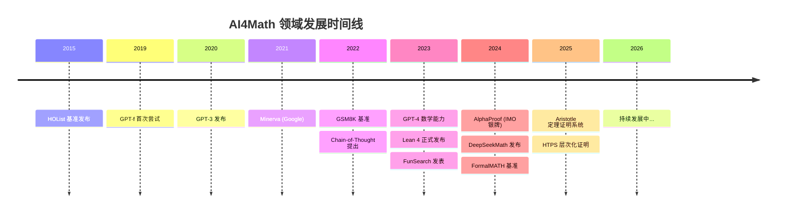

```mermaid
timeline
    title AI4Math 领域发展时间线
    2015 : HOList 基准发布
    2019 : GPT-f 首次尝试
    2020 : GPT-3 发布
    2021 : Minerva (Google)
    2022 : GSM8K 基准 : Chain-of-Thought 提出
    2023 : GPT-4 数学能力 : Lean 4 正式发布 : FunSearch 发表
    2024 : AlphaProof (IMO 银牌) : DeepSeekMath 发布 : FormalMATH 基准
    2025 : Aristotle 定理证明系统 : HTPS 层次化证明
    2026 : 持续发展中...
```